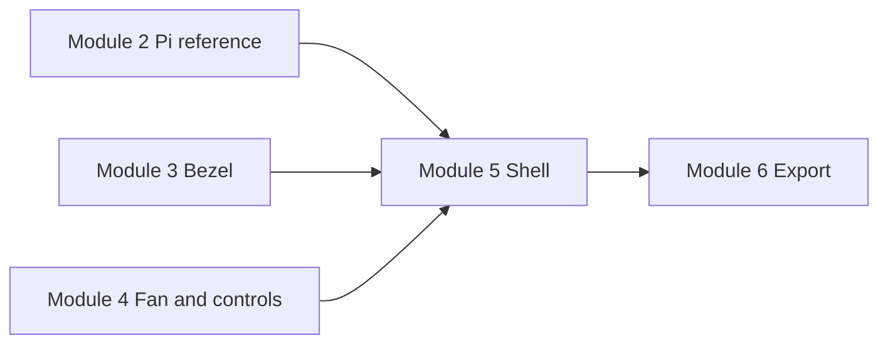

# arci — System architecture

Read this **before** or **right after** Module 1 if you want the whole picture: what you are modeling in FreeCAD, how those pieces relate in the **real console**, and how the **course modules** map to them.

**Related docs:** [component_specs.md](component_specs.md) (numbers), [curriculum.md](curriculum.md) (lesson order), [README.md](README.md) (overview).

---

## FreeCAD file habit (naming the tree)

Use **one `.FCStd` document** for the whole console while you follow the course. **Prefer** spreadsheet objects as **direct children of the document** (siblings of your Bodies)—easier to read than nesting under a Body. **If your build will not reparent** a sheet or tree drags fail, **continue anyway:** expressions use **`SpreadsheetName.Alias`**, not the sheet’s parent in the tree. On some builds, the **second** sheet (**`Spreadsheet_Bezel`**) only appears if you **create `Body_Bezel` first** and insert the spreadsheet with that Body active—Module 3 documents that as **Path B**. Use **clear names** so Pi vs bezel vs shell data stay separate: e.g. **`Spreadsheet_Pi`** (Module 2) and **`Spreadsheet_Bezel`** (Module 3). **Rename** Bodies and major features the same way—Module 2 spells out **F2** renaming in **[Organize the tree (rename things)](02_pi4_modeling/README.md#organize-the-tree-rename-things)**; apply the pattern for `Body_Bezel`, `Body_Shell`, etc.

---

## Units and scale

Course CAD values are **millimeters (mm)** unless you change the FreeCAD document. The **Pi footprint** (85 × 56 mm) is **small on screen** because it matches a real PCB. The **visible console** is driven mainly by the **7″ display** (~165 × 104 mm face in [component_specs.md](component_specs.md)) plus **wall thickness** and **margins** you add in the enclosure.

---

## Physical product (what you are designing toward)

**arci** is a **retro-style console**: a **hollow shell** holds a **Raspberry Pi 4**, a **7″ LCD display** on the **front**, **cooling** (40 mm fan over the Pi), **arcade controls** on a **user-facing panel**, and **cutouts** for **power/USB** (and similar) on the **outside**. You buy the electronics once; the printed/laser-cut parts are what you **fabricate from the CAD**.

---

## CAD strategy: several bodies, one mental assembly

You do **not** model one monolithic lump from day one. You build **separate Part Design bodies** (and sketches) that stand for **distinct real parts or regions**:

| Real-world idea | Typical FreeCAD representation | Introduced in course |
|-----------------|--------------------------------|----------------------|
| Raspberry Pi 4 PCB | Board outline + mounting holes (reference solid or sketch) | [Module 2](02_pi4_modeling/README.md) |
| Display + front frame | Bezel / window **Body** (opening, tolerance, mount logic) | [Module 3](03_display_integration/README.md) |
| Fan + control surface | Fan footprint / mount; button & stick layout on a face | [Module 4](04_cooling_and_controls/README.md) |
| Outer case | Hollow **shell** with walls and **port cutouts** | [Module 5](05_enclosure_design/README.md) |
| Build readiness | Collision checks; **STL** / **DXF** export | [Module 6](06_manufacturing_prep/README.md) |

The **Pi model** is primarily a **reference**: it answers “where is the board and its holes?” so standoffs, airflow, and **clearance** stay honest. The **printed** pieces are mostly **shell, bezel, and brackets**—not a second physical Pi.

---

## How the pieces fit together (inside → outside)

Think in **layers** from what the user touches to what sits in the cavity:

```text
                    ┌── outer shell (Module 5) ──────────────────┐
                    │                                              │
     front ────────►│  bezel + screen (Module 3)                   │
                    │                                              │
                    │  control panel: stick + buttons (Module 4)   │
                    │                                              │
     inside ──────►│  Pi (Module 2) + fan mount / airflow (Mod 4)  │
                    │                                              │
                    │  port cutouts in shell (USB, power, …)       │
                    └──────────────────────────────────────────────┘
```

- **Outside / user-visible:** **Shell** surfaces and **bezel** around the **LCD**; **buttons and joystick** on the **designated face**; **exposed ports** through **shell holes**.
- **Inside:** **Pi** mounted (screws into standoffs or tray aligned to **Module 2** hole pattern). **Fan** draws air over the Pi per your **Module 4** layout. **Wiring** routes in the void left by **shelling** (**Module 5**).

**Attachment (conceptual — your exact geometry is parametric):**

1. **Shell ↔ bezel / screen:** The **bezel** registers the **display module** and mates to the **front** of the **shell** (snap, screws, or friction—your design choice within the tutorials).
2. **Shell ↔ Pi:** **Standoffs** or a **tray** inside the shell match **Pi mounting holes** from **Module 2**; the Pi sits **parallel** to the internal reference you kept.
3. **Shell ↔ fan:** **Fan mount** (Module 4) is either **part of the shell** or a **sub-part** fixed to the shell or Pi area so airflow lines up with the SoC.
4. **Shell ↔ controls:** The **panel** carrying **stick + buttons** is a **face** of the assembly (top, sloped deck, etc.—defined as you progress); **hole diameters** follow **component_specs.md** and **Module 4**.
5. **Shell ↔ world:** **Port cutouts** (Module 5) align **real connectors** (see **USB panel mount** and power in [component_specs.md](component_specs.md)).

Exact **dimensions** and **constraint chains** live in the **module READMEs** and **spreadsheet** aliases—not duplicated here.

---

## Module flow vs architecture



**Module 1** is tooling only (FreeCAD setup). **Modules 2–5** add **design bodies** that **converge** into one **assembly intent**; **Module 6** **validates** and **exports**.

---

## What “done” looks like

A coherent **arci** CAD story ends with: **internal volume** clears **Pi, fan, joystick depth, and buttons**; **screen** sits in the **bezel**; **shell** exposes **needed ports**; and **exported files** match what a **printer or laser shop** expects. Use **Module 6** for systematic checks before you send files out.
